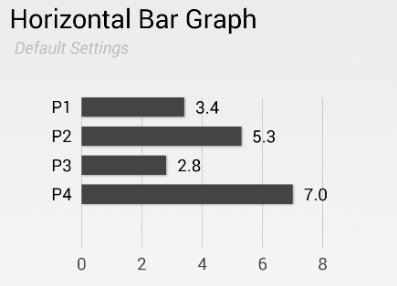
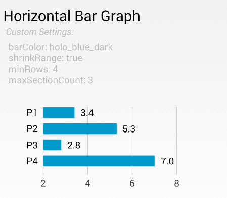
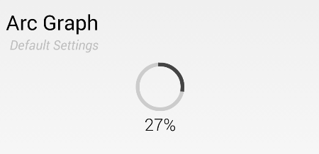
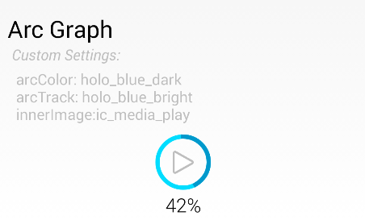

# Family Plot

__An Android Charting Library__


Its was hard to find a decent horizontal bar graph for Android in the wild.
Instead of whining about it, we decided to build one. We figured others may
have a similar need...

...and so was born the [__*Family Plot*__](http://www.imdb.com/title/tt0074512/). [[1]](#footnote1)

So far, we only have two chart types, but we think they are pretty nice. We hope
you do too.

# The Graphs

### Horizontal Bar Graphs



There are a few customizations you can make on the chart.

* Bar color and thickness
* Value color, text size, and visibility
* Label color, text size, and visibility
* Axis color, text size, and visibility
* Can stack from top to bottom or bottom to top
* Configure the number of sections/gridlines
* You can compress the axis range

Here is an example of a chart that has been customized:



Check the [attrs.xml](library/src/main/res/values/attrs.xml) for the
list of attributes you can use.

### Arc Graphs



The arc graph is customizable too. Here is an arc graph that has been
customized:



Again,check the [attrs.xml](library/src/main/res/values/attrs.xml) for the
list of attributes you can use.


# License

```
Copyright 2014 Vertigo Software, Inc.

Licensed under the Apache License, Version 2.0 (the "License");
you may not use this file except in compliance with the License.
You may obtain a copy of the License at

    http://www.apache.org/licenses/LICENSE-2.0

Unless required by applicable law or agreed to in writing, software
distributed under the License is distributed on an "AS IS" BASIS,
WITHOUT WARRANTIES OR CONDITIONS OF ANY KIND, either express or implied.
See the License for the specific language governing permissions and
limitations under the License.
```

---

<a name="footnote1" class="anchor" href="#footnote1">[1]</a>: _At [Vertigo](http://www.vertigo.com), we like to name stuff after [Hitchcock](http://www.imdb.com/name/nm0000033/) movies._
